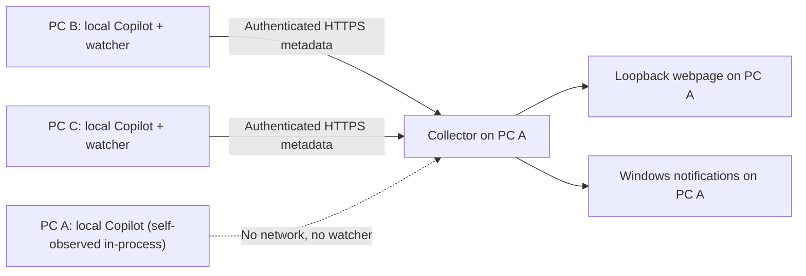

# Copilot session monitor for Windows

A standalone, metadata-only monitor for Copilot work on **explicitly paired Windows PCs** on a shared LAN or existing private VPN. One collector PC shows the compact dashboard and receives native notifications. The collector automatically observes its own machine's Copilot sessions — no separate local watcher needed. A watcher is only required on each *additional* PC whose sessions you want to see on the collector's dashboard.

The multi-machine changes are currently a working-tree implementation; use this same version on every PC. A previously published version may support only one machine. There are no npm dependencies, cloud relay, accounts, service installation, or automatic startup registration.

## Components



- **Collector self-observation:** the collector polls its own machine's Copilot sessions directly in-process (the same cadence/logic as a watcher, reused internally) and feeds them into its own pipeline under a fixed, built-in local reporter identity. No separate watcher process, pairing step, or network hop is needed for the collector's own machine. Set `$env:MONITOR_SELF_OBSERVE = '0'` before starting the collector to disable this and go back to requiring an explicit local watcher instead.
- **Watcher:** reads only its own machine's Copilot metadata/events and process evidence. It reduces lifecycle, attached background work, and canonical parent/child relationships, then posts bounded metadata. It has no dashboard webpage or completion-notification tray, and needs no chat/model running. It does show a small tray icon with a **"Connect to host..."** menu for pairing (see below). Use a watcher only for *other* machines — not the collector's own, which is self-observed automatically.
- **Collector:** receives reports, retains machine-scoped families, owns dismissal and notification dedupe, serves the dashboard, and runs the notification tray — including a **"Generate connection request for a sub machine..."** menu item for pairing new watchers. It never opens a remote Copilot database or filesystem.
- These are **two logical roles**, not a promise of two OS PIDs. Each Node process has a Windows PowerShell helper that also renders that role's tray icon and menu. The watcher's helper supplies process/power evidence and the pairing dialog; the collector's helper supplies Windows theme, power events, notifications, and the connection-string generator.

## Requirements

- Windows 10/11 with Windows PowerShell and a current .NET Framework; the collector needs an interactive Windows desktop for tray notifications.
- [Node.js](https://nodejs.org/) **24 or newer**, on `PATH`. **No `npm install` is needed.**
- Each watcher needs a supported local Copilot installation writing `%USERPROFILE%\.copilot`. The source adapter was verified against desktop 1.1.24 / CLI 1.0.90-0 and is undocumented/version-sensitive.
- A current Edge/Chromium browser on the collector PC.
- For multiple PCs: an existing LAN/private VPN route and permission to receive TCP on the selected collector interface/ingestion port. This app does not set up a VPN or change firewall rules.

## One-machine quick start

Obtain the source, then run in PowerShell from its directory:

```powershell
git clone https://github.com/rchiodo/copilot-session-monitor.git
cd .\copilot-session-monitor
.\Start-Tray.ps1 /host
```

For unreleased changes, copy the working source to another PC **without `.local`, `.git`, or generated evidence** rather than assuming GitHub already contains those changes.

`Start-Tray.ps1 /host` prepares an app-local certificate, then starts the collector, which immediately shows this machine's own Copilot sessions (self-observed in-process — no separate watcher to start or pair). The webpage remains **http://127.0.0.1:43187**. HTTPS reporting uses **127.0.0.1:43188** by default; no LAN interface is opened. Existing instances are reused.

```powershell
.\Start-Host-Headless.ps1 -NoBrowser
.\Stop-Host.ps1
```

Closing the browser, terminal, or Copilot chat does not stop the collector. Start again after signing in/rebooting. `Stop-Host.ps1` stops the collector, never Copilot sessions.

An existing single-machine installation from before this version migrates automatically the first time the collector starts with self-observation enabled (the default). It makes a narrowly scoped `.local\backup-<timestamp>` of the monitor's old session and notification stores, preserves the notification ledger (no replayed/duplicate alerts), and namespaces records under a stable local reporter identity — reusing any prior local watcher's identity file if present, so restarts don't appear as a new machine. A session row from the old store that can't be freshly reconfirmed on the very next poll surfaces once as **unconfirmed**, never silently dropped or duplicated. Original legacy files remain untouched. No Copilot data is migrated or changed. If you still have a separate local watcher running from a prior version, stop it (`.\Stop-Client.ps1`) before restarting the collector, to avoid two processes reporting under the same local identity at once.

## Multiple-machine setup

Use the same source version on each PC. Choose **one collector PC** with a stable private IP reachable through your LAN or existing VPN. The IP below is a synthetic example; replace it with an assigned IP on that PC. Wildcard/public binds are rejected. The collector PC's own sessions are already shown automatically (self-observation) — this section is only for adding *additional* PCs.

### Recommended: tray + clipboard connection string

This is a Live-Share-style pairing flow: generate a one-time connection string on the collector PC, copy it to the clipboard, and paste it into the watcher's tray dialog on the other PC. There is no separate file to transfer.

**On the collector PC**, stop the local roles, opt into a private interface, then start the tray app in host mode:

```powershell
.\Stop-Host.ps1
.\Initialize-Host.ps1 -BindAddress 192.168.1.20 -IngestPort 43188 -Reconfigure
.\Start-Tray.ps1 /host
```

This adds an HTTPS **ingestion-only** listener on the selected IP. Local ingestion stays available on loopback. The webpage and its controls still bind only to `127.0.0.1:43187`; they are not exposed to the LAN.

Right-click the collector's tray icon and choose **"Generate connection request for a sub machine..."**. Optionally type a label to identify the source PC (e.g. "Development laptop"), then OK. A connection string — prefixed `csm1:` — is copied to the clipboard and a confirmation toast appears. The string is a compact, opaque, base64-encoded bundle containing the collector's reachable IP/port (not loopback), a fresh write-only bearer credential, and the collector's certificate fingerprint; it is valid for pairing exactly one machine. Treat it like a credential: don't paste it into chat, a browser, source control, or a public channel. Generate a separate string for each source PC, even if their hostnames are identical.

**On each remote Windows PC**, with the source checked out, start the tray app in its default child/watcher mode:

```powershell
.\Start-Tray.ps1
```

Right-click its tray icon, choose **"Connect to host..."**, paste the connection string into the dialog, and click OK. The watcher validates the string (rejecting malformed or wrong-version input with a clear error dialog instead of failing silently), pins the collector's certificate, stores the pairing under `.local`, and immediately begins the normal watcher reporting cadence — no separate "start reporting" step. A confirmation toast shows the host address and reporter label.

Check **paired source coverage** on the collector dashboard for its label, short unique identity, connection state, and last-received time. Native notifications appear **only on the collector PC**. To stop that source watcher, use its tray icon's **"Stop watcher"** item or:

```powershell
.\Stop-Client.ps1
```

No remote production connectivity is assumed just because local tests pass. After pairing a second physical PC, verify its Connected status and a naturally occurring run/finish in the collector. Nothing here drives existing Copilot work to manufacture a result.

### Collector-only and watcher-only operation

| Command | Role |
| --- | --- |
| `.\Start-Tray.ps1 /host` | Recommended host entry point: identical to `Start-Host-Headless.ps1`, with a tray icon offering "Generate connection request...". |
| `.\Start-Tray.ps1` (no args) | Recommended child entry point: identical to `Start-Client-Headless.ps1`, with a tray icon offering "Connect to host...". |
| `.\Initialize-Host.ps1` | Prepare collector config/certificate, loopback-only unless a private IP is explicitly selected. |
| `.\Start-Host-Headless.ps1 -NoBrowser` | Start only the collector; no local Copilot installation is required. |
| `.\Stop-Host.ps1` | Stop only the collector; watchers will report unavailable and retry. |
| `.\Start-Client-Headless.ps1` / `.\Stop-Client.ps1` | Start/stop an already paired watcher. No dashboard webpage or completion notifications; only a small tray icon for pairing. |

The tray and webpage **Stop collector** control stops only the collector. Do not point one checkout's watcher at multiple collectors.

For a different dashboard port, set `$env:MONITOR_PORT = '43189'` before starting the collector. The dashboard port must differ from the HTTPS ingestion port. Self-observation is on by default; set `$env:MONITOR_SELF_OBSERVE = '0'` before starting the collector to disable it if you prefer running an explicit separate local watcher instead (e.g. `configuration.mjs local` plus `Start-Client-Headless.ps1` pointed at loopback). For foreground diagnostics after configuration, `npm start` runs the collector; `node .\src\watcher.mjs` runs the watcher. Stop foreground processes with Ctrl+C.

If local PowerShell script policy blocks execution and your organization's policy permits a one-process override:

```powershell
powershell.exe -NoProfile -ExecutionPolicy Bypass -File .\Start-Tray.ps1 /host
```

This does not change saved execution policy. Do not bypass an organization's enforced policy.

## Trust, credentials, and network boundaries

- HTTPS is mandatory for reports, including local reports. The app creates a self-signed certificate **in memory**, stores the PFX only under `.local`, and never installs it into a Windows trust store.
- A watcher explicitly trusts only its imported collector certificate for this connection, with normal certificate expiry and IP/SAN verification. There is no global TLS bypass or plaintext-LAN-token mode.
- Setup restricts this app's private `.local` directory ACL to the current Windows user and SYSTEM. This affects only monitor files, not global Windows policy. Credentials/private keys are not encrypted against programs already running as your user.
- Each credential can connect/report/disconnect **only its own reporter identity**. It cannot read other reporters, change collector configuration, dismiss cards, stop the collector, or access browser controls.
- First connection binds the pairing to the watcher's durable installation identity. Competing boots and copied pairings cannot silently replace a live source. Never copy a watcher's full `.local` directory to another PC; reusing its complete private identity is outside this trust boundary.
- The collector allows only a user-selected assigned private/loopback interface. No automatic firewall, certificate-store, OS startup, or VPN changes are made. If inbound traffic is blocked, obtain approval and configure the specific private-network rule yourself.

To revoke a remote credential on the collector, use its reporter ID from the private pairing file or dashboard details:

```powershell
node .\src\configuration.mjs revoke REPORTER-ID
```

Revocation preserves retained metadata but makes that source unavailable. It does not delete Copilot work. To rotate the certificate or change the listening IP, stop the collector and use `Initialize-Host.ps1 ... -Reconfigure`. The local profile and retained exported pairing files are updated. Stop remote watchers and re-import their updated **same-identity** pairing files through the trusted channel before restarting. Certificates expire after two years; they are not silently renewed or trusted. Keep private pairing/identity backups; a new pairing is a distinct source, not a hostname-based merge.

## Reading the dashboard

Two compact columns show **Running** and **Finished / Needs input**. The latter also contains distinct **Error**, **Interrupted**, and **Unconfirmed** states; placement alone is not proof of completion.

Each card is one canonical parent plus linked descendants **on that source**. A working parent or any observed descendant keeps the family Working, including attached PowerShell commands or task agents after the foreground model stops. Stable reporter IDs namespace every session/family ID, so copied session IDs and duplicate hostnames never merge. Cross-machine parent links are not guessed.

Cards show a source label/short identity, readable title, state, and the parent's own latest monitor alert/time. A child alert never replaces the parent's alert; a parent's Finished alert may coexist with family Working. No assistant-response preview is sent or displayed.

Expand a card for full titles, all known linked descendants, nested status, machine identity, parent alert, and timestamps. Dormant children are **Not observed**, not assumed idle or finished. Details and keyboard focus survive normal refresh/reordering.

Each column sorts by the parent's latest assistant-response timestamp, with labeled first-observed fallback. Source timestamps remain source timestamps, not invented collector response times. Keep Windows clocks synchronized; reports over 30 seconds out of sync or containing future lifecycle times are unconfirmed. Dates render in the dashboard browser's time zone.

Collapsed rows are approximately 56px on desktop, with about ten visible at a 1200x900 CSS-pixel viewport. Columns stack at widths of 900px or less. Expanded/narrow rows may be taller. Light/dark appearance follows the **collector PC's** Windows app preference (`AppsUseLightTheme`), including live changes; the UI explicitly labels browser-theme fallback.

### Dismissal and notifications

**Dismiss** removes a single safely finished or unconfirmed entry from this monitor's visible list; **Clear finished** bulk-removes only finished entries. Neither ever touches Copilot sessions/files/history/worktrees. Working, waiting, error, and offline families cannot be dismissed. Unconfirmed families (for example, a session that finished before the monitor started observing it) are dismissable per-row so they do not get stuck permanently — the same revision-key safety check applies, so a family that resumes activity after its unconfirmed key was issued cannot be silently dismissed.

The collector checks current report freshness and completed-run revision on each action; stale revisions are skipped. New parent/descendant work restores the family on the next report. Network delay means a source change is not instantaneous at the collector, but a dismissal cannot permanently hide subsequently reported new work. Dismissal survives restart. During source uncertainty a previously dismissed card may reappear as Unconfirmed; unchanged safely revalidated finishes remain dismissed.

Completion alerts mean **the observed current family runs finished**, not that a task, tests, or PR succeeded. The collector requires continuous same-lease observation, working-run evidence, safe member states, and an explicit family finish notice. A silently omitted member, cleared foreground flag, or lack of output cannot finish a family.

Use **Test notification** in the collector page/tray to check native delivery. Windows Focus / Do not disturb and notification policy can suppress tray balloons. Even Windows reporting "shown" is not proof that you saw a banner. The app never changes notification settings.

## Protocol and failure behavior

The ingestion listener exposes only authenticated `POST /v1/connect`, `/v1/report`, and `/v1/disconnect`. JSON protocol version 1 is bounded to 4 MiB/report, 5,000 retained members and 5,000 related names per source, 100 issues, and 100 paired sources. Extra/invalid fields, oversized bodies, and unsupported versions are rejected rather than truncated into false success.

Each watcher has a durable installation ID, increasing boot generation, fresh boot ID, collector-issued lease, and increasing sequence. Exact duplicate reports are acknowledged without replay; reordered/conflicting reports and old leases are rejected. A newer boot cannot seize an active lease. A crash may require waiting for the 15-second lease to expire.

Watchers normally report about every 1.5 seconds. Missing heartbeats for 15 seconds, disconnection, clock skew, unavailable readers/owners, unsupported evidence, and collector restart make affected families Unconfirmed; these are dismissable per-row (bulk Clear finished remains finished-only) once a stable revision key can be computed for them. Other connected machines remain visible as working. Source coverage lists paired-but-never-connected and revoked/offline sources rather than implying all machines are idle.

Reconnect starts a fresh baseline and drops completion authority across the gap. Work that finished while the collector could not continuously observe it is not retroactively promoted to confirmed completion. Previously confirmed unchanged finishes can be restored, but old alerts do not replay. Notification dedupe is durable and **at-most-once**: a crash between persistence and delivery may lose an alert rather than duplicate it.

The watcher retains the existing conservative lifecycle reducer. Same-run terminal evidence, unchanged live owners, and settled attached background work are necessary for completion. Explicitly detached services do not hold a run open. Waiting/input/approval, errors, missing exits, cancellation, partial JSONL, rotation, sleep, and unsupported forms are not successful completion.

## Sources, privacy, and limits

Each watcher opens its own `%USERPROFILE%\.copilot\data.db` read-only and incrementally reads its own `session-state\<id>\events.jsonl`. It uses canonical workspace/runtime aliases, parent links, chat creator/side-chat metadata, `inuse.<pid>.lock`, process ancestry, and creation times. The persisted `is_running` flag alone is **not** reliable full-session activity.

No session UI scraping, authenticated cloud endpoints, Copilot authentication tokens, automatic prompts, resume/abort, or Copilot settings/database writes are used. See [GitHub's session data documentation](https://docs.github.com/en/copilot/concepts/security-governance-and-network-settings/session-data); the schemas/status envelopes used here remain unofficial/version-sensitive.

Raw event bytes are read temporarily on the source to derive state. Only bounded lifecycle metadata leaves it: session IDs/titles, source identity, hierarchy, statuses, timestamps, and monitor alerts. No raw prompts, response text, commands, tool outputs, file contents, or executable instructions are transmitted.

Private files remain under Git-ignored **`.local\`**:

| Files | Purpose |
| --- | --- |
| `collector.json`, `collector.pfx`, `collector-cert.pem`, `pairing-*.json` | Collector identity, reporter credential hashes, TLS material, private transfer bundles. |
| `collector-state.json`, `notifications.json` | Central retained source/family metadata, first-seen times, dismissals, and notification dedupe. |
| `watcher.json`, `watcher-identity.json`, `watcher-sessions.json` | Private pairing/credential, stable installation/generation, local metadata-only observation cache (remote-watcher mode). |
| `collector-local-identity.json`, `collector-local-sessions.json` | The collector's own self-observation installation/generation identity and metadata-only observation cache for its own machine. |
| `runtime.json`, `watcher-runtime.json`, `*.lock`, `*-error.log`, `*.log` | Local process/control identity and diagnostics. No reporter credentials are placed in normal logs. |
| `backup-*`, legacy `sessions.json` | Preserved one-machine migration state. |

Do not publish these files, real Copilot databases/events, screenshots, or diagnostic snapshots. Dismissal hides cards but does not erase internal metadata. Other programs running as your Windows user can access local controls; this is not a hostile multi-user or public-Internet service. An authorized/compromised watcher can report false metadata **for its own identity**; the collector is not a remote attestation system.

Standalone CLI coverage is **activity-only**, without full-run completion notifications. SDK `session.idle`/`assistant.idle` signals are ephemeral, not recoverable from JSONL. Short transitions entirely between observations, hidden input gates, internal deadlocks, remote/cloud work lacking a paired Windows source, and unsupported background mechanisms remain limitations. No unrelated idle archive is imported.

## Troubleshooting

- **Start fails:** check `node --version` and the relevant `.local\collector-error.log` or `watcher-error.log`. Configuration must precede collector-only startup; pairing must precede watcher-only startup.
- **Watcher unavailable:** expand source coverage. Verify collector is running, route/private IP/port are correct, and any approved firewall rule permits that specific interface. The web URL is not the HTTPS ingestion URL.
- **TLS/auth error:** compare certificate fingerprints, expiry, IP/SAN, system clocks, and imported pairing. Re-import the correct bundle; do not disable TLS verification. A revoked credential requires an explicitly authorized pairing.
- **Identity conflict:** do not copy private installation files or run two watchers from the same identity. Stop the prior instance or wait for lease expiry after a crash; use a unique pairing for each machine.
- **Collector not healthy after restart:** if a stale runtime/lock refers to a reused PID, verify the old monitor is gone before removing those specific monitor files. Never kill Copilot processes or delete all `.local` data.
- **No cards:** old idle archive entries are intentionally absent. Empty lists are not proof that an unpaired or unsupported machine is idle.
- **Unconfirmed:** inspect source/member reasons. Restore observation and allow a new naturally occurring run; do not interpret uncertainty as completion.
- **Port conflict:** stop this installation's existing roles or choose separate free dashboard/ingestion ports.

## Development and verification

```powershell
npm test
node --disable-warning=ExperimentalWarning --test .\test\collector.test.mjs .\test\controls.test.mjs .\test\background.test.mjs .\test\source.test.mjs
node .\scripts\verify-ui.mjs
node .\scripts\check-ui.mjs
```

Tests use synthetic metadata and owned temporary directories. The Windows integration test creates app-local test certificates, launches a real HTTPS collector, two independent reporter transport processes with colliding session IDs/hostnames, and the full watcher executable against an empty synthetic Copilot home. It exercises TLS/auth/schema/size rejection, namespace isolation, notifications, dismissal/resume, heartbeat loss, migration, restart, and dedupe. It never dismisses production records.

The separate browser fixture harness prints a loopback URL and checks both themes, compactness, long names, source labels, disclosure/focus, and wide/narrow layouts using real UI assets. It never reads Copilot data. Results appear on the page and `/results`; stop it with Ctrl+C. `check-ui.mjs` automates the harness using an installed, isolated headless Edge instance and cleans up its own profile/processes. Add `--live` only to also inspect the local collector's rendering read-only. Loopback process tests are not proof of a physical second machine's VPN/firewall setup.

## License

[MIT](LICENSE). Copyright (c) 2026 Rich Chiodo.
